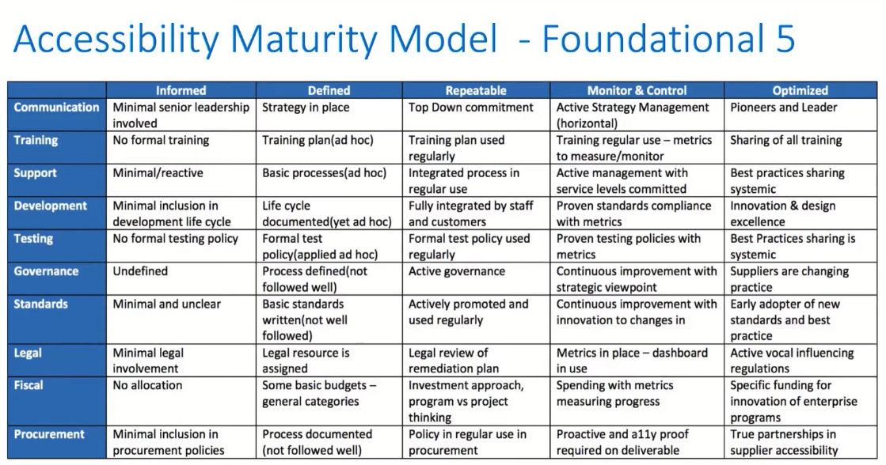

# 210611 Scaling an Accessibility Program Efficiently @ Deque

https://www.youtube.com/watch?v=6pSEZEUhtLs (stopped watching at 34:46)

## Resources

Read: [Agile Accessibility Handbook](https://accessibility.deque.com/agile-accessibility-handbook)

## Notes

Key roles in content creation process: designers, developers, quality assurance capabilities. 5 reasonable capabilities.

### Foundational 5:

1. Inclination (mandate) to execute accessibility
   - Executive buy-in absolutely required
   - Measured impact to the organisation (disruption). E.g. costs.
   - Being a solution, not a problem
   - Focus on big picture scale and efficiency
   - Policy and governance won't work without accountability
2. Time to practice accessibility
   - Product owner and scrum master key understanding
   - Efficiency of solutions (% of SDLC (software development lifecycle) points/time). Up to 10%, down to 2-3% as target.
   - Disruption of teams to integrate (training and coaching)
   - Ongoing team and company churn
3. Introductory and role specific accessibility training
   - The basics - disability, assistive tech, accommodation 🔍, accessibility
   - Timing - must be able to build & exercise "muscle memory"
   - Role specific:
     - Design - how might someone use my content differently than I expect
     - Development - how does the assistive technology utilise my code
     - QA/Test - how do I use assistive tech and automation
4. Tools and automation (to make it easier)
   - Full automation picks up to 50% of issues
   - Intelligent guided testing, up to 85%
5. Access to expert for very difficult situations
   - Goal. execute accessibility without team of accessibility experts. How? Make it easy enough that expert knowledge is occasional need (having everyone be an expert is overkill)
   - However, you can have enthusiasts

### 7 transformation practices

1. Obtain executive buy-in. Think multi-year budgeting.
2. Create a central team to manage accessibility. E.g. create content to some standard such as WCAG 2.x
3. Create and enforce an accessibility policy
4. Report on your accessibility transformation
5. Give the teams accessibility coaches
6. Execute an ongoing empathy programme
7. Publish learning resources and bulletins